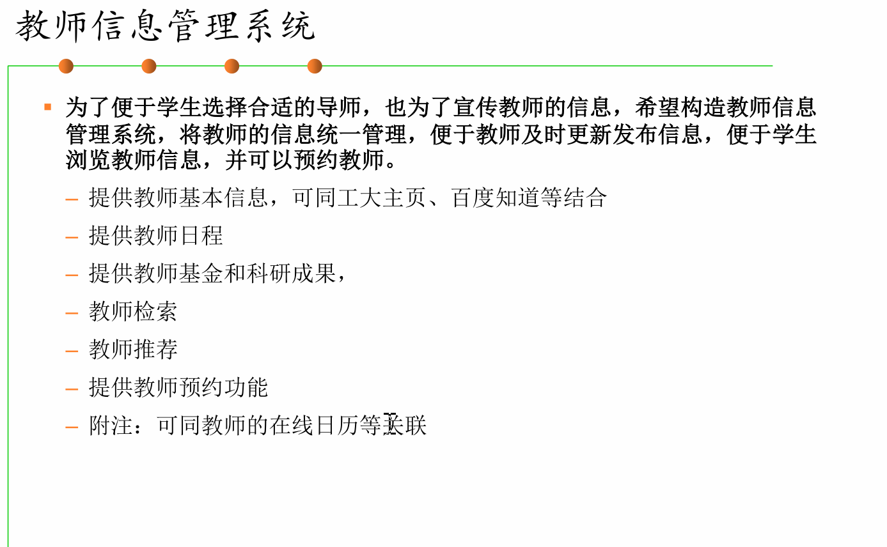

1. 根据项目需求建立用户故事清单，使用敏捷开发方法为用户故事建模卡片，规划优先级，估计工作量，构思迭代计划；

2. 练习使用CodeArts或其他自选的Scrum项目管理工具为项目建立迭代计划 ；

3. 练习使用大模型设计软件原型；

4. 练习使用MockPlus或其他自选的原型设计工具为每个用户故事设计软件原型。

1. 根据讨论纪要，提取形成用户故事清单； 

2. 为每个用户故事形成卡片；
3. 分析用户故事的优先级； 
4. 组内成员采用表决和投票的方式，估算各用户故事的工作量； 
5. 根据以上结果，设计项目的迭代开发计划； 
6. 使用CodeArts或其他自选的Scrum项目管理工具建立和管理迭代计划 ； 
7. 选取一个用户故事，使用大模型进行原型设计； 
8. 使用MockPlus或其他自选的原型设计工具对关键的用户故事进行原型设计 (GUI)；

## 选题

教师信息管理系统              16

**为了便于学生选择合适的导师，也为了宣传教师的信息，希望构造教师信息** 

**管理系统，将教师的信息统一管理，便于教师及时更新发布信息，便于学生** 

**浏览教师信息，并可以预约教师。** 

– 提供教师基本信息，可同工大主页、百度知道等结合 

– 提供教师日程 

– 提供教师基金和科研成果， 

– 教师检索 

– 教师推荐 

– 提供教师预约功能 

– 附注：可同教师的在线日历等关联

## 项目需求 001

以下是针对教师信息管理系统的具体详细用户故事清单以及产品待办列表（backlog）：

### 用户故事清单

    1. **学生浏览教师基本信息**
     * **用户角色** ：学生
     * **功能需求** ：能够方便地浏览教师的基本信息，包括姓名、性别、专业、职称、联系方式等，以便为选择导师提供依据。
     * **验收条件** ：学生登录系统后，可在首页的教师列表中查看到每位教师的基本信息，信息完整准确且展示清晰易读。
    
    2. **教师更新基本信息**
     * **用户角色** ：教师
     * **功能需求** ：能够及时更新和发布自己的基本信息，如修改联系方式、更新个人简介等，确保学生获取到的是准确的最新信息。
     * **验收条件** ：教师登录系统后，在个人中心页面有 “编辑信息” 入口，可对基本信息进行修改并保存成功，修改后的信息能实时展示在学生端。
    
    3. **学生查看教师日程安排**
     * **用户角色** ：学生
     * **功能需求** ：可以查看教师的日程安排，以选择合适的时间预约教师进行咨询或交流。
     * **验收条件** ：学生在教师详情页面点击 “日程安排” 标签，可查看该教师一周内的详细日程，包括上课时间、会议时间、空闲时间等，日程信息准确且更新及时。
    
    4. **教师维护日程安排**
     * **用户角色** ：教师
     * **功能需求** ：能够添加、修改或删除自己的日程安排，并让学生能够查看到最新的日程信息。
     * **验收条件** ：教师在个人中心的 “日程管理” 页面，可进行日程的添加、编辑和删除操作，操作完成后，学生端查看到的日程信息相应更新。
    
    5. **学生了解教师基金和科研成果**
     * **用户角色** ：学生
     * **功能需求** ：能够了解教师的基金和科研成果，包括获得的科研基金项目、发表的论文、著作等，以评估教师的学术水平和研究方向，辅助选择导师。
     * **验收条件** ：学生在教师详情页面的 “科研成果” 标签下，可查看教师的基金项目列表和科研成果列表，包括项目名称、时间、成果简介等详细信息。
    
    6. **教师添加和展示基金和科研成果**
     * **用户角色** ：教师
     * **功能需求** ：可以添加和展示自己的基金和科研成果，提升个人学术影响力，吸引更多学生关注。
     * **验收条件** ：教师在个人中心的 “科研成果管理” 页面，可添加新的基金项目和科研成果，包括填写项目名称、时间、成果简介等信息，添加成功后，学生端可查看到相应内容。
    
    7. **学生通过多种方式检索教师**
     * **用户角色** ：学生
     * **功能需求** ：能够通过多种方式检索教师，如按专业、职称、姓名等，快速找到自己感兴趣的教师。
     * **验收条件** ：学生在首页的搜索框中，可输入教师姓名、专业名称或选择职称进行搜索，搜索结果准确显示符合条件的教师列表。
    
    8. **学生获得教师推荐**
     * **用户角色** ：学生
     * **功能需求** ：能够根据自己的专业、兴趣等因素，获得系统推荐的教师。
     * **验收条件** ：学生登录系统后，在首页的 “推荐教师” 区域，系统根据学生所学专业和之前浏览的教师信息等，推荐 3 - 5 位合适的教师，推荐结果符合逻辑且有一定针对性。
    
    9. **学生预约教师**
     * **用户角色** ：学生
     * **功能需求** ：能够方便地预约教师，在线选择预约时间和咨询事项，并收到预约提醒。
     * **验收条件** ：学生在教师详情页面点击 “预约” 按钮，进入预约页面，可选择预约日期和时间（根据教师日程安排中的空闲时间），填写咨询事项后提交预约。预约成功后，学生可在 “我的预约” 中查看预约信息，并在预约前收到系统发送的提醒消息（如短信或站内信）。
    
    10. **教师查看和管理预约信息**
    * **用户角色** ：教师
    * **功能需求** ：能够查看和管理学生的预约信息，包括查看预约详情、确认或取消预约等。
    * **验收条件** ：教师在个人中心的 “预约管理” 页面，可查看所有学生的预约请求列表，包括预约时间、学生姓名、咨询事项等信息。教师可对预约进行确认或取消操作，操作后学生端的预约状态相应更新。

### 产品待办列表（backlog）

| 序号 | 用户故事                                    | 优先级 | 预计工作量（人 - 天） | 负责人 |
| ---- | ------------------------------------------- | ------ | --------------------- | ------ |
| 1    | 学生浏览教师基本信息                        | 高     | 3                     | 张三   |
| 2    | 教师更新基本信息                            | 高     | 2                     | 李四   |
| 3    | 学生查看教师日程安排                        | 高     | 3                     | 王五   |
| 4    | 教师维护日程安排                            | 高     | 2                     | 赵六   |
|      | 学生了解教师基金和科研成果（1）（可看报告） | 高     | 3                     | 钱七   |
|      | 教师添加和展示基金和科研成果（2）           | 高     | 2                     | 孙八   |
| 7    | 学生通过多种方式检索教师                    | 中     | 3                     | 周九   |
| 8    | 学生获得教师推荐                            | 中     | 4                     | 吴十   |
| 9    | 学生预约教师                                | 高     | 4                     | 郑十一 |
| 10   | 教师查看和管理预约信息                      | 高     | 3                     | 王十二 |

以上用户故事清单和产品待办列表可根据小组实际情况和进一步的需求分析进行调整和完善。

- [ ] 前端 刘
- [ ] 后端 李
- [ ] 数据库 王

## 项目需求002

### 用户故事卡片（正/反面）

以下为「教师信息管理系统」Web版在需求分析与原型设计阶段的用户故事卡片，包含“正面”（用户故事）与“反面”（成功与失败场景），有助于更全面地理解需求。

------

### 学生角色

**卡片ID**：S-01
**标题**：按关键词与条件搜索导师
**正面：用户故事**：作为学生，我希望在系统中通过姓名、学科关键词、学院或研究方向等多维度条件进行搜索与筛选，以便快速定位合适的导师。
**反面：成功与失败场景**：

- **成功**：输入关键词后，系统实时返回多条符合条件的教师列表，学生能点击进入详情页。
- **失败**：输入无效关键词或网络异常时，系统提示“未找到结果”或“网络错误，请重试”。
  **优先级**：高
  **备注**：需与后端检索 API 联调。

**卡片ID**：S-02
**标题**：浏览导师详情与科研成果
**正面：用户故事**：作为学生，我希望在导师详情页查看其个人简介、教学与科研背景、基金项目和论文成果，以便评估导师的学术水平和研究方向。
**反面：成功与失败场景**：

- **成功**：详情页模块加载完整，科研成果按年份排序，点击外链可正常跳转。
- **失败**：若成果数据缺失或接口超时，系统展示“暂无数据”提示，并允许刷新重试。
  **优先级**：中
  **备注**：与教师端数据展示保持一致风格。

**卡片ID**：S-03
**标题**：查看并同步导师日程
**正面：用户故事**：作为学生，我希望能在老师详情页查看其公开的日程和可预约时间，并同步到我的个人日历，以便合理安排面谈时间。
**反面：成功与失败场景**：

- **成功**：点击“一键同步”后，日程正确导入用户日历，并在提醒中心显示同步记录。
- **失败**：若第三方日历接口授权失败或导出文件损坏，系统提示“同步失败，请检查授权或重试”。
  **优先级**：高
  **备注**：需评估日历 API 限制与数据安全。

**卡片ID**：S-04
**标题**：在线预约与通知
**正面：用户故事**：作为学生，我希望提交预约申请后，能收到系统确认消息和日程变更通知，以便及时调整计划。
**反面：成功与失败场景**：

- **成功**：预约提交后，系统发送“预约成功”通知；若教师接受或拒绝，分别发送确认或改期通知。
- **失败**：若教师未响应或网络异常，系统定时提醒用户并允许重新提交。
  **优先级**：高
  **备注**：需与消息中心与邮件服务集成。

卡片ID**：S-05**

标题**：**学生获得教师推荐

 * **用户角色** ：学生
 * **功能需求** ：能够根据自己的专业、兴趣等因素，获得系统推荐的教师。
 * **验收条件** ：学生登录系统后，在首页的 “推荐教师” 区域，系统根据学生所学专业和之前浏览的教师信息等，推荐 3 - 5 位合适的教师，推荐结果符合逻辑且有一定针对性。

------

### 教师角色

**卡片ID**：T-01
**标题**：维护个人主页与科研展示
**正面：用户故事**：作为教师，我希望自由编辑个人主页内容，包括头像、简介、研究方向、项目和成果展示，以便学生了解我的专业背景。
**反面：成功与失败场景**：

- **成功**：编辑后页面即时预览，发布后学生端可立即查看最新信息。
- **失败**：若富文本内容格式错误或保存失败，系统展示详细错误并保留编辑内容。
  **优先级**：高
  **备注**：需实现富文本编辑器与版本控制功能。

**卡片ID**：T-02
**标题**：设置日程与第三方日历同步
**正面：用户故事**：作为教师，我希望设置可预约的办公时间，并将日程与 Google Calendar、Outlook 等第三方日历同步，以减少重复维护。
**反面：成功与失败场景**：

- **成功**：OAuth 授权完成后，办公时间自动推送至第三方日历；后续调整也即时同步。
- **失败**：授权超时或 API 限制，系统提示“同步暂不可用”，并保留本地配置。
  **优先级**：高
  **备注**：需评估 OAuth 安全与频率限制。

**卡片ID**：T-03
**标题**：审批与管理预约请求
**正面：用户故事**：作为教师，我希望在系统内查看学生的预约请求详情，并能够接受、拒绝或提出改期建议，以便高效安排。
**反面：成功与失败场景**：

- **成功**：审批操作后，系统实时更新请求状态并发送通知；列表准确反映当前状态。
- **失败**：若操作超时或通知发送失败，系统提示“操作失败，请重试”并保留原有请求状态。
  **优先级**：中
  **备注**：与通知中心、日志管理关联。

------

### 管理员角色

**卡片ID**：A-01
**标题**：管理平台用户与权限
**正面：用户故事**：作为管理员，我希望能够创建、编辑与删除学生和教师账号，并分配相应角色和权限，以保证系统安全与数据准确。
**反面：成功与失败场景**：

- **成功**：用户操作后系统日志记录完整，账号变动即时生效；相应人员收到通知。
- **失败**：若批量导入文件格式错误或超出权限范围，系统提示具体错误并回滚操作。
  **优先级**：高
  **备注**：需与权限框架（RBAC）集成。

**卡片ID**：A-02
**标题**：定时同步外部数据源
**正面：用户故事**：作为管理员，我希望配置并执行与工大主页、百度知道等外部平台的教师信息定时同步，以保持数据最新。
**反面：成功与失败场景**：

- **成功**：同步任务定时执行，新增/更新数据准确导入；日志显示成功明细。
- **失败**：若接口限流或数据冲突，系统在日志中记录失败项，并生成报表供人工审核。
  **优先级**：中
  **备注**：需考虑 API 限流与数据清洗。

**卡片ID**：A-03
**标题**：推荐算法与统计报表
**正面：用户故事**：作为管理员，我希望能调整导师推荐算法参数，并查看系统使用统计（搜索热度、预约量、活跃用户），以优化系统效果。
**反面：成功与失败场景**：

- **成功**：参数调整后推荐结果及时更新，并能在测试环境对比效果；统计报表准确展示数据。

- **失败**：若算法执行异常或统计接口超时，系统提示“操作失败”，并可回滚至上一个稳定版本。
  **优先级**：低
  **备注**：初期可使用默认参数，后续迭代。

  

------

### 产品待办列表（Backlog）

以下为基于用户故事卡片整理的产品待办列表（Backlog），已按优先级从高到低排序，数字越大优先级越高。上游故事编号对应本表中的“用户故事编号”。

| 用户故事编号 | 用户故事简称             | 用户故事描述                                                 | 优先级估算 | 上游故事编号 |
| ------------ | ------------------------ | ------------------------------------------------------------ | ---------- | ------------ |
| 1            | 学生搜索导师             | 作为学生，我希望在系统中通过姓名、学科关键词、学院或研究方向等多维度条件进行搜索与筛选，以便快速定位合适的导师。 | 5          | –            |
| 2            | 学生查看导师日程         | 作为学生，我希望能在导师详情页查看其公开的日程和可预约时间，并同步到我的个人日历，以便合理安排面谈时间。 | 5          | 1            |
| 3            | 在线预约与通知           | 作为学生，我希望提交预约申请后，能收到系统确认消息和日程变更通知，以便及时调整计划。 | 5          | 2            |
| 4            | 维护个人主页与科研展示   | 作为教师，我希望自由编辑个人主页内容，包括头像、简介、研究方向、项目和成果展示，以便学生了解我的专业背景。 | 5          | –            |
| 5            | 设置日程与第三方日历同步 | 作为教师，我希望设置可预约的办公时间，并将日程与 Google Calendar、Outlook 等第三方日历同步，以减少重复维护。 | 5          | 4            |
| 6            | 管理平台用户与权限       | 作为管理员，我希望能够创建、编辑与删除学生和教师账号，并分配相应角色和权限，以保证系统安全与数据准确。 | 5          | –            |
| 7            | 浏览导师详情与科研成果   | 作为学生，我希望在导师详情页查看其个人简介、教学与科研背景、基金项目和论文成果，以便评估导师的学术水平和研究方向。 | 3          | 1            |
| 8            | 学生查询推荐教师         | 作为学生，我希望能够根据自己的专业、兴趣等因素，获得系统推荐的教师。 | 3          | 1            |
| 9            | 审批与管理预约请求       | 作为教师，我希望在系统内查看学生的预约请求详情，并能够接受、拒绝或提出改期建议，以便高效安排。 | 3          | 5            |
| 10           | 外部数据源定时同步       | 作为管理员，我希望配置并执行与工大主页、百度知道等外部平台的教师信息定时同步，以保持数据最新。 | 3          | –            |
| 11           | 推荐算法与统计报表       | 作为管理员，我希望能调整导师推荐算法参数，并查看系统使用统计（搜索热度、预约量、活跃用户），以优化系统效果。 | 1          | –            |

## 原型设计

如果项目下有requirements.txt文档（项目的依赖清单），可以直接通过终端使用 pip install -r requirements.txt 进行安装

# 教师信息管理系统前端界面设计

## 一、首页设计

  * **页面布局** ：
    * **顶部导航栏** ：左侧是系统的 logo 和名称 “教师信息管理系统”，右侧设置 “首页”“教师列表”“我的预约”（学生登录后显示）/“预约管理”（教师登录后显示）“个人中心” 等导航链接，方便用户在不同页面间快速切换。
    * **搜索区域** ：在导航栏下方，设置一个宽大的搜索框，占满页面宽度的 60% 左右，搜索框左侧有 “搜索教师” 的提示文字，右侧有下拉菜单，可供选择按 “姓名”“专业”“职称” 等条件进行搜索，搜索框右侧有搜索按钮，按钮上以图标和文字结合的方式显示 “搜索”。
    * **推荐教师区域** ：在搜索区域下方，以横向滚动的卡片形式展示推荐教师，每张卡片展示教师的姓名、专业、推荐理由（如 “该教师在 [领域] 有丰富的教学和科研经验”）等信息，卡片上方有教师的照片，照片圆形展示，吸引用户注意。卡片宽度适中，保证在页面上能同时展示 3 - 4 张卡片，卡片之间有适当的间距，整体排列整齐美观。在区域的左上角用醒目的文字标注 “推荐教师”，右上角设置 “更多” 链接，点击后跳转到教师列表页面，展示更多的教师信息。
    * **教师列表区域** ：在推荐教师区域下方，以网格布局的形式展示教师列表，每行展示 4 位教师的信息，每位教师以一张卡片形式呈现，卡片宽度一致，高度适中，保证展示的信息完整且不显得拥挤。卡片上展示教师的姓名、性别、专业、职称、联系方式等基本信息，教师的照片以较小的圆形展示在卡片的左上角。卡片整体采用简洁的设计风格，背景色为浅色，边框圆润，鼠标悬停时有轻微的阴影效果，增加交互感。在教师列表区域的左上角设置 “教师列表” 标题，右上角设置筛选条件，如 “按专业筛选”“按职称筛选” 等下拉菜单，方便用户快速筛选教师。

  * **功能说明** ：
    * 用户登录系统后，根据用户角色（学生或教师）显示不同的导航链接和功能区域。学生登录后显示 “我的预约” 链接，教师登录后显示 “预约管理” 链接。
    * 搜索功能支持模糊搜索，当用户输入教师姓名的部分拼音或专业名称的关键词时，系统能准确返回符合条件的教师列表。搜索结果按照匹配度从高到低进行排序，保证用户能快速找到目标教师。
    * 推荐教师的展示是根据学生的专业和浏览历史等进行动态推荐的。系统会定期根据学生的操作行为更新推荐结果，以提供更精准的教师推荐服务。学生可以点击 “更多” 链接查看完整的教师列表，教师列表页面的布局与首页的教师列表区域类似，但在该页面可以进行更详细的筛选和排序操作。
    * 教师列表区域的筛选条件可以根据用户的选择进行组合筛选，如先选择专业再选择职称，快速定位到特定的教师群体。教师卡片上的信息清晰简洁，方便学生快速浏览和了解教师的基本情况，点击教师卡片可进入教师详情页面查看更多详细信息。

## 二、教师详情页面设计

  * **页面布局** ：
    * **顶部信息栏** ：展示教师的姓名、性别、专业、职称等基本信息，教师的照片以较大的尺寸展示在左侧，照片圆形展示，右侧依次排列教师的基本信息，信息采用大号字体展示，保证在页面上突出显示教师的关键信息。在信息栏的右侧设置 “关注” 按钮（学生登录后显示）和 “编辑” 按钮（教师登录后显示），“关注” 按钮方便学生关注感兴趣的教师，后续能在个人中心查看关注的教师动态；“编辑” 按钮供教师快速进入个人信息编辑页面。
    * **标签导航区域** ：在顶部信息栏下方，设置标签导航，包括 “基本信息”“日程安排”“科研成果”“预约” 四个标签，标签采用简洁的文本形式，下方有下划线标识当前选中的标签。标签之间的间距适中，保证用户能清晰地区分不同的标签内容。初始状态下，默认选中 “基本信息” 标签。
    * **内容展示区域** ：
      * **基本信息标签页** ：以表格形式展示教师的详细基本信息，包括出生日期、联系方式、个人简介、教育背景、工作经历等。表格的表头采用深色背景，文字为白色，突出显示信息类别；表格的内容区域背景为白色，文字为黑色，保证信息的可读性。个人简介、教育背景、工作经历等较长文本信息以可折叠的形式展示，初始状态下展示部分内容，用户可点击 “展开” 按钮查看完整内容，再次点击则折叠回去，方便用户快速浏览和展开查看详细信息。
      * **日程安排标签页** ：以日历形式展示教师一周内的详细日程安排，日历的标题栏显示当前周的起止日期，日历主体部分分为七列，分别对应周一至周日。每一天的时间段从早上 8 点到晚上 8 点，以 1 小时为间隔进行划分，每个时间段内以不同颜色和文字标注展示教师的日程安排，如 “上课”“会议”“空闲” 等。上课时间用蓝色标注，会议时间用绿色标注，空闲时间用灰色标注，方便学生直观地了解教师的日程状态。学生可点击具体的日程安排查看详细信息，如上课的课程名称、会议的主题等。在日历的右侧设置 “刷新” 按钮，教师更新日程后，学生可点击刷新按钮获取最新的日程信息。
      * **科研成果标签页** ：分为 “基金项目” 和 “科研成果” 两个子标签，子标签采用类似的标签导航形式，初始状态下选中 “基金项目” 子标签。在 “基金项目” 子标签页，以列表形式展示教师的基金项目，列表项包括项目名称、时间、项目简介等信息，项目名称采用加粗字体显示，时间显示在项目名称下方，项目简介以简短的文字概括项目的主要内容，用户可点击查看详细简介。在 “科研成果” 子标签页，以列表形式展示教师的科研成果，包括论文、著作等，列表项显示成果名称、发表时间、成果简介等信息，成果名称加粗显示，发表时间位于名称下方，成果简介简要概括成果的核心内容和意义，用户点击可查看详细的成果信息，如论文的摘要、关键词，著作的目录等。
      * **预约标签页** ：在页面上方以日历形式展示教师的可预约时间段，日历的标题栏显示当前月的名称，日历主体部分以网格形式展示一个月的日期，每个日期方块内以不同颜色标注是否可预约，绿色表示可预约，红色表示不可预约（如教师有其他安排或已被预约满）。在日历的右侧设置预约信息填写区域，当用户点击可预约的日期方块后，该区域激活，显示可预约的时间段选择（如上午、下午、晚上），以及咨询事项的输入框。咨询事项输入框采用多行文本框形式，方便学生详细描述预约咨询的内容。在填写区域的底部设置 “提交预约” 按钮，按钮采用醒目的颜色（如蓝色），文字为白色，保证用户能快速找到并点击提交预约。提交成功后，页面会弹出提示框显示 “预约成功”，并在 “我的预约” 页面（学生登录后）或 “预约管理” 页面（教师登录后）更新预约信息。

  * **功能说明** ：
    * 教师详情页面是学生和教师了解教师详细信息的核心页面，通过标签导航的方式，将不同类别的信息进行分类展示，方便用户快速找到所需内容。
    * “关注” 按钮方便学生对感兴趣的教师进行标记，后续在个人中心的 “关注” 页面能查看关注教师的最新动态，如日程变更、科研成果更新等。
    * 日程安排标签页以直观的日历形式展示教师的每周日程，帮助学生合理安排预约时间，避免与教师的其他安排冲突。教师可随时在个人中心的 “日程管理” 页面更新日程安排，学生在该页面能及时获取到最新的日程信息。
    * 科研成果标签页详细展示了教师的科研成就，为学生选择导师提供重要的参考依据。通过子标签的划分，学生能清晰地区分基金项目和科研成果，方便快速浏览和深入了解教师的科研情况。
    * 预约标签页的预约流程简洁明了，学生通过点击日历选择可预约的日期和时间段，填写咨询事项后即可完成预约。系统在学生提交预约后，自动向教师发送预约通知，提醒教师查看和确认预约。

## 三、学生预约页面设计

  * **页面布局** ：
    * **顶部标题栏** ：简单展示 “预约教师” 的页面标题，标题采用大号字体，居中显示，背景色为浅蓝色，给用户一种清新的感觉。
    * **教师信息展示区域** ：以卡片形式展示教师的基本信息，包括照片、姓名、专业、职称等，照片圆形展示在卡片左侧，右侧依次排列教师的基本信息，信息采用简洁的排版方式，保证用户能快速识别教师身份。
    * **预约信息填写区域** ：
      * **预约日期选择** ：采用日历控件展示可预约的日期范围，当前日期及以后的日期可选，已过去的日期和教师不可预约的日期（如教师已满额预约或其他特殊安排）显示为灰色不可选状态。日历控件上方有月份导航按钮，用户可点击切换月份查看不同月份的可预约日期。在日历的右侧设置本周可预约日期的快速选择按钮，以文字形式列出周一至周日的日期，方便用户快速点击选择本周的预约日期。
      * **预约时间段选择** ：根据教师的日程安排，在选择预约日期后，下方展示可预约的时间段选项，以按钮形式展示，如 “上午（8:00 - 12:00）”“下午（14:00 - 18:00）”“晚上（19:00 - 21:00）”，可预约的时间段按钮背景为蓝色，文字为白色；不可预约的时间段按钮背景为灰色，文字为浅灰色。用户点击选择一个时间段后，按钮状态变为选中状态，背景色加深，直观地显示已选择的时间段。
      * **咨询事项填写** ：采用多行文本框形式，供学生详细描述预约咨询的内容，文本框上方有 “咨询事项” 字样的提示标签，文本框内有 “请简要描述您的咨询事项” 的占位提示文字，引导用户填写内容。文本框的高度适中，保证用户能输入足够长的咨询事项描述，同时页面布局不显得过于冗长。
      * **提交预约按钮** ：在预约信息填写区域的底部设置 “提交预约” 按钮，按钮采用醒目的绿色，文字为白色，按钮宽度适中，放置在页面中央，方便用户点击提交预约。按钮在鼠标悬停时有轻微的放大效果，增加交互感。

  * **功能说明** ：
    * 学生预约页面是一个独立的页面，用于学生填写和提交预约信息。该页面在学生点击教师详情页面的 “预约” 按钮后打开，页面上自动加载教师的基本信息，避免学生重复输入教师信息，提高预约效率。
    * 预约日期选择采用日历控件，方便学生直观地查看可预约的日期范围，快速选择合适的预约日期。同时，提供本周可预约日期的快速选择功能，满足学生急需预约的需求。
    * 预约时间段选择根据教师的日程安排动态生成，确保学生选择的时间段是教师可预约的，避免预约冲突。时间段选项以按钮形式展示，用户点击即可快速选择，操作简单便捷。
    * 咨询事项填写区域为学生提供了足够的空间详细描述预约的咨询内容，帮助教师提前了解学生的咨询需求，提高预约咨询的效率和质量。
    * 提交预约按钮设计醒目且易于点击，用户完成预约信息填写后，点击提交按钮即可完成预约操作。系统在提交后会自动跳转到预约成功提示页面，并在 “我的预约” 页面更新预约信息，同时向教师发送预约通知。

## 四、教师个人中心页面设计

  * **页面布局** ：
    * **左侧导航栏** ：宽度适中，采用深色背景，文字为白色，设置 “个人信息”“日程管理”“科研成果管理”“预约管理” 等导航链接，链接图标采用简洁的线条图标，与文字结合直观地展示各功能模块的含义。当前选中的导航链接背景色加深，与未选中的链接形成明显对比，帮助用户快速识别当前所在的页面。左侧导航栏采用固定布局，当页面滚动时始终保持在页面左侧，方便用户随时切换不同的功能模块。
    * **右侧内容区域** ：
      * **个人信息页面** ：以表单形式展示教师的个人信息，包括姓名、性别、专业、职称、联系方式、个人简介、教育背景、工作经历等。每个信息项左侧为表单项名称标签，右侧为相应的输入框或文本域，输入框和文本域的宽度一致，保证页面布局整齐美观。表单项之间有适当的间距，避免页面显得拥挤。在页面底部设置 “保存” 按钮，按钮采用蓝色背景，白色文字，宽度适中，放置在页面中央，方便用户在修改完信息后点击保存。按钮在鼠标悬停时有轻微的阴影效果，增加交互感。
      * **日程管理页面** ：上方以日历形式展示教师当前的月日程安排，日历标题栏显示当前月的名称，日历主体部分以网格形式展示日期，每个日期方块内以不同颜色标注日程安排状态，蓝色表示有上课安排，绿色表示有会议安排，灰色表示空闲。在日历的右侧设置 “添加日程” 按钮，按钮采用绿色背景，白色文字，点击后弹出添加日程的表单。表单包含日程类型选择（上课、会议、空闲等）、日期时间选择、地点填写、备注添加等字段，字段采用表单控件，方便教师填写和选择。在页面的下方以列表形式展示已添加的详细日程安排，列表项包括日程类型、日期时间、地点、备注等信息，每条日程记录右侧设置 “编辑” 和 “删除” 按钮，按钮采用图标形式，方便教师快速进行日程的编辑和删除操作。
      * **科研成果管理页面** ：分为 “基金项目” 和 “科研成果” 两个子标签，子标签采用标签导航形式，初始状态下选中 “基金项目” 子标签。在 “基金项目” 子标签页，以列表形式展示已添加的基金项目，列表项包括项目名称、时间、项目简介等信息，项目名称采用加粗字体显示。在列表上方设置 “添加基金项目” 按钮，按钮采用蓝色背景，白色文字，点击后弹出添加基金项目的表单，表单包含项目名称、时间、项目简介等字段。在 “科研成果” 子标签页，以列表形式展示已添加的科研成果，包括论文、著作等，列表项显示成果名称、发表时间、成果简介等信息，成果名称加粗显示。列表上方设置 “添加科研成果” 按钮，点击弹出添加表单，表单包含成果名称、发表时间、成果简介等字段。对于已添加的基金项目和科研成果，每条记录右侧设置 “编辑” 和 “删除” 按钮，方便教师进行修改和删除操作。
      * **预约管理页面** ：以列表形式展示学生的预约请求，列表项包括预约时间、学生姓名、咨询事项、预约状态等信息。列表项采用简洁的表格形式，表头背景为深色，文字为白色，突出显示信息类别；表格内容区域背景为白色，文字为黑色，保证信息的可读性。在列表项的右侧设置操作按钮，包括 “确认” 和 “取消” 按钮，“确认” 按钮采用绿色背景，白色文字，“取消” 按钮采用红色背景，白色文字，按钮文字简洁明了，方便教师快速进行操作。在页面的上方设置筛选条件，如按预约时间、学生姓名等进行筛选，方便教师快速查找特定的预约请求。在页面的右上角设置 “导出预约信息” 按钮，教师可将预约信息导出为 Excel 等格式，方便进行数据统计和分析。

  * **功能说明** ：
    * 教师个人中心页面是教师管理和维护个人信息、日程安排、科研成果以及处理学生预约的核心页面。左侧导航栏提供了清晰的功能模块划分，方便教师快速切换到所需的功能页面。
    * 个人信息页面以表单形式展示教师的详细信息，教师可方便地修改和更新个人信息，确保学生获取到的是准确的教师资料。保存按钮设计醒目，方便教师在修改后及时保存信息。
    * 日程管理页面的日历视图帮助教师直观地了解自己一个月的日程安排，方便进行整体规划和调整。添加日程按钮和编辑、删除功能使教师能灵活地维护日程信息，确保学生能获取到最新的日程安排，合理安排预约。
    * 科研成果管理页面通过子标签划分基金项目和科研成果，使教师能分类管理自己的科研成就。添加、编辑和删除功能方便教师及时更新科研成果信息，展示自己的学术实力和研究方向。
    * 预约管理页面以列表形式清晰地展示学生的预约请求，教师可快速查看预约详情，并进行确认或取消操作。筛选功能和导出功能进一步提高了教师管理预约的效率和便捷性。

以上前端界面设计是一个整体的框架，涵盖了教师信息管理系统的主要功能模块和页面布局。在实际的开发过程中，可以根据具体的业务需求和用户体验的反馈进行进一步的优化和调整，确保系统的界面友好、功能完善，为教师和学生提供便捷高效的服务。

## 以下是针对上述界面的大模型原型设计提示词：

### 首页

设计教师信息管理系统首页，页面顶部有导航栏，左侧是系统 logo 和名称，右侧有 “首页”“教师列表”“我的预约”（学生登录后）/“预约管理”（教师登录后）“个人中心” 等链接。导航栏下方是搜索区域，有宽大搜索框，左侧可输入关键词，右侧有下拉菜单选择搜索条件（按姓名、专业、职称等），右侧有搜索按钮。搜索区域下方是推荐教师区域，以横向滚动卡片形式展示推荐教师，卡片上有教师照片、姓名、专业、推荐理由，左上角有 “推荐教师” 标题，右上角有 “更多” 链接。再下方是教师列表区域，以网格布局展示教师卡片，卡片上有教师照片、姓名、性别、专业、职称、联系方式等信息，左上角有 “教师列表” 标题，右上角有筛选条件（按专业、职称等下拉菜单）。

### 教师详情页面

设计教师详情页面，页面顶部是教师基本信息栏，左侧是教师照片，右侧依次排列姓名、性别、专业、职称等信息，右侧有 “关注”（学生登录后）和 “编辑”（教师登录后）按钮。下方是标签导航，包括 “基本信息”“日程安排”“科研成果”“预约” 四个标签。内容展示区域：

  * 基本信息标签页：以表格形式展示教师详细信息（出生日期、联系方式、个人简介、教育背景、工作经历等），个人简介、教育背景、工作经历等长文本信息可折叠展示。
  * 日程安排标签页：以日历形式展示教师一周日程，日历标题栏显示当前周起止日期，主体分为七列（周一至周日），8:00 - 20:00 按 1 小时间隔划分时间段，上课用蓝色、会议用绿色、空闲用灰色标注日程安排，右侧有 “刷新” 按钮。
  * 科研成果标签页：分为 “基金项目” 和 “科研成果” 子标签，“基金项目” 子标签页以列表展示教师基金项目（项目名称、时间、简介等），“科研成果” 子标签页以列表展示教师科研成果（成果名称、发表时间、简介等）。
  * 预约标签页：上方以日历形式展示教师可预约时间段（当前月日期，绿色表示可预约，红色表示不可预约），右侧是预约信息填写区域，可预约日期点击后激活，可选择预约时间段（上午、下午、晚上），填写咨询事项，底部有 “提交预约” 按钮。

### 学生预约页面

设计学生预约页面，顶部有 “预约教师” 标题栏（浅蓝色背景）。页面主体部分：

  * 教师信息展示区域：以卡片形式展示教师照片、姓名、专业、职称等信息。
  * 预约信息填写区域：
    * 预约日期选择：采用日历控件展示可预约日期范围，当前及以后日期可选，已过去和不可预约日期灰色不可选。日历上方有月份导航按钮，右侧有本周可预约日期快速选择按钮（周一至周日）。
    * 预约时间段选择：根据教师日程，展示可预约时间段选项（上午、下午、晚上按钮形式，可预约时间段蓝色背景、白色文字，不可预约灰色背景、浅灰色文字）。
    * 咨询事项填写：多行文本框，上方有 “咨询事项” 提示标签，内有占位提示文字。
    * 提交预约按钮：页面底部有 “提交预约” 按钮（绿色背景、白色文字，鼠标悬停有放大效果）。

### 教师个人中心页面

设计教师个人中心页面，左侧是深色背景导航栏，有 “个人信息”“日程管理”“科研成果管理”“预约管理” 等导航链接，当前选中链接背景色加深。右侧内容区域：

  * 个人信息页面：以表单形式展示教师个人信息（姓名、性别、专业、职称、联系方式、个人简介、教育背景、工作经历等），每个信息项左侧是标签，右侧是输入框或文本域，底部有 “保存” 按钮（蓝色背景、白色文字）。
  * 日程管理页面：上方以日历形式展示当月日程安排，右侧有 “添加日程” 按钮（绿色背景、白色文字）。下方以列表展示已添加日程（类型、日期时间、地点、备注等信息），每条记录右侧有 “编辑”“删除” 按钮。
  * 科研成果管理页面：分为 “基金项目” 和 “科研成果” 子标签。“基金项目” 子标签页以列表展示项目（名称、时间、简介等），上方有 “添加基金项目” 按钮（蓝色背景、白色文字）。“科研成果” 子标签页以列表展示成果（名称、发表时间、简介等），上方有 “添加科研成果” 按钮。每条记录右侧有 “编辑”“删除” 按钮。
  * 预约管理页面：以列表形式展示学生预约请求（预约时间、学生姓名、咨询事项、状态等），表头深色背景、白色文字，内容区域白色背景、黑色文字。上方有筛选条件（按预约时间、学生姓名等），右上角有 “导出预约信息” 按钮，每条记录右侧有 “确认”（绿色背景、白色文字）和 “取消”（红色背景、白色文字）按钮。

## 数据库

根据文档内容，以下是教师信息管理系统的数据库表详细设计：

### 1. 教师信息表 (teacher_info)
| 字段名         | 数据类型     | 描述            | 约束        |
| -------------- | ------------ | --------------- | ----------- |
| teacher_id     | INT          | 教师 ID（主键） | PRIMARY KEY |
| name           | VARCHAR(50)  | 教师姓名        | NOT NULL    |
| gender         | VARCHAR(10)  | 性别            | NOT NULL    |
| birth_date     | DATE         | 出生日期        |             |
| college        | VARCHAR(100) | 所在学院        |             |
| major          | VARCHAR(100) | 专业            |             |
| research_field | VARCHAR(200) | 研究方向        |             |
| contact        | VARCHAR(100) | 联系方式        |             |
| avatar         | VARCHAR(255) | 头像图片路径    |             |

### 2. 教师日程表 (teacher_schedule)
| 字段名      | 数据类型     | 描述                           | 约束        |
| ----------- | ------------ | ------------------------------ | ----------- |
| schedule_id | INT          | 日程 ID（主键）                | PRIMARY KEY |
| teacher_id  | INT          | 教师 ID（外键）                | FOREIGN KEY |
| date        | DATE         | 日程日期                       | NOT NULL    |
| start_time  | TIME         | 开始时间                       | NOT NULL    |
| end_time    | TIME         | 结束时间                       | NOT NULL    |
| content     | VARCHAR(255) | 日程内容                       | NOT NULL    |
| status      | VARCHAR(20)  | 日程状态（如上课、会议、空闲） | NOT NULL    |

### 3. 基金项目表 (fund_project)
| 字段名     | 数据类型      | 描述            | 约束        |
| ---------- | ------------- | --------------- | ----------- |
| fund_id    | INT           | 基金 ID（主键） | PRIMARY KEY |
| teacher_id | INT           | 教师 ID（外键） | FOREIGN KEY |
| name       | VARCHAR(100)  | 基金名称        | NOT NULL    |
| source     | VARCHAR(100)  | 基金来源        |             |
| start_date | DATE          | 项目开始日期    | NOT NULL    |
| end_date   | DATE          | 项目结束日期    | NOT NULL    |
| amount     | DECIMAL(10,2) | 项目金额        |             |

### 4. 科研成果表 (research_outcome)
| 字段名       | 数据类型     | 描述                       | 约束        |
| ------------ | ------------ | -------------------------- | ----------- |
| outcome_id   | INT          | 成果 ID（主键）            | PRIMARY KEY |
| teacher_id   | INT          | 教师 ID（外键）            | FOREIGN KEY |
| type         | VARCHAR(50)  | 成果类型（如论文、专利等） | NOT NULL    |
| name         | VARCHAR(100) | 成果名称                   | NOT NULL    |
| publish_date | DATE         | 发表日期                   | NOT NULL    |
| journal      | VARCHAR(100) | 发表期刊（如果是论文）     |             |
| description  | TEXT         | 成果描述                   |             |

### 5. 学生信息表 (student_info)
| 字段名         | 数据类型     | 描述            | 约束        |
| -------------- | ------------ | --------------- | ----------- |
| student_id     | INT          | 学生 ID（主键） | PRIMARY KEY |
| name           | VARCHAR(50)  | 学生姓名        | NOT NULL    |
| student_number | VARCHAR(20)  | 学号            | NOT NULL    |
| major          | VARCHAR(100) | 专业            |             |
| grade          | INT          | 年级            |             |

### 6. 预约记录表 (appointment_record)
| 字段名           | 数据类型    | 描述                                 | 约束        |
| ---------------- | ----------- | ------------------------------------ | ----------- |
| appointment_id   | INT         | 预约 ID（主键）                      | PRIMARY KEY |
| student_id       | INT         | 学生 ID（外键）                      | FOREIGN KEY |
| teacher_id       | INT         | 教师 ID（外键）                      | FOREIGN KEY |
| appointment_date | DATE        | 预约日期                             | NOT NULL    |
| appointment_time | TIME        | 预约时间                             | NOT NULL    |
| status           | VARCHAR(20) | 预约状态（如待确认、已确认、已取消） | NOT NULL    |
| reason           | TEXT        | 预约事由                             |             |

### 表关系
- 教师信息表与教师日程表、基金项目表、科研成果表通过 `teacher_id` 进行关联。
- 学生信息表与预约记录表通过 `student_id` 关联。
- 教师信息表与预约记录表通过 `teacher_id` 关联。

## 参考

#### **一、需求分析与规划**

1. 分析用户需求，明确系统的目标是方便学生选择导师、宣传教师信息，主要功能包括教师基本信息管理、教师日程管理、教师基金和科研成果展示、教师检索、教师推荐、教师预约以及与在线日历等的关联。
2. 规划系统架构，采用 B/S 架构，使用后端 Django 框架、数据库 MySQL 和 前端 Vue.js 。

#### **二、数据库设计**

1. 设计数据库表结构：
   - **教师信息表** ：存储教师的基本信息，如教师 ID、姓名、性别、出生日期、所在学院、专业、研究方向、联系方式等。教师 ID 作为主键，用于与其他表关联。
   - **教师日程表** ：记录教师的日程安排，包括日程 ID、教师 ID（外键）、日程日期、开始时间、结束时间、日程内容等。一个教师可以有多个日程记录。
   - **基金项目表** ：存储教师参与的基金项目信息，如基金 ID、教师 ID（外键）、基金名称、基金来源、项目起止时间、项目金额等。
   - **科研成果表** ：记录教师的科研成果，包括成果 ID、教师 ID（外键）、成果类型（如论文、专利等）、成果名称、发表时间、发表期刊（如果是论文）、成果描述等。
   - **学生信息表** ：保存学生的基本信息，如学生 ID、姓名、学号、专业、年级等，用于学生登录和预约功能。
   - **预约记录表** ：记录学生对教师的预约信息，包含预约 ID、学生 ID（外键）、教师 ID（外键）、预约时间、预约状态（如待确认、已确认、已取消等）、预约事由等。
2. 确定表之间的关系和约束：
   - 教师信息表与教师日程表、基金项目表、科研成果表通过教师 ID 进行关联，一个教师可以有多个日程、基金项目和科研成果。
   - 学生信息表与预约记录表通过学生 ID 关联，一个学生可以有多条预约记录。
   - 教师信息表与预约记录表通过教师 ID 关联，用于记录学生对教师的预约情况。

#### **三、后端开发**

1. 用户认证与授权：
   - 开发教师和学生的注册、登录接口，使用加密算法对用户密码进行加密存储。教师具有更新和发布自己信息的权限，学生具有浏览教师信息和预约教师的权限。
   - 实现基于用户角色的权限控制，区分教师用户和学生用户，确保不同用户只能进行相应的操作。
2. 教师信息管理接口：
   - **教师基本信息管理接口** ：教师可以通过前端页面提交自己的基本信息更新请求，后端接收请求后，将数据更新到教师信息表中。同时，可设置接口与工大主页、百度知道等外部平台进行数据同步，获取教师的公开信息并整合到系统中。
   - **教师日程管理接口** ：教师可以添加、修改、删除自己的日程安排，后端将日程数据存储到教师日程表中。系统还可与教师的在线日历（如 Google Calendar、Outlook Calendar 等）进行关联，实现日程的自动同步和更新。
   - **教师基金和科研成果管理接口** ：教师可以提交自己的基金项目和科研成果信息，后端将数据存储到相应的基金项目表和科研成果表中，方便学生查看和了解教师的科研能力和成就。
3. 教师检索接口：
   - 实现根据教师姓名、所在学院、专业、研究方向等条件进行检索的接口，后端通过数据库查询操作，快速返回符合条件的教师信息列表，方便学生查找合适的导师。
4. 教师推荐接口：
   - 开发教师推荐算法，根据学生的专业、研究兴趣等因素，从数据库中筛选出合适的教师进行推荐。推荐算法可以综合考虑教师的研究方向与学生需求的匹配度、教师的科研成果数量和质量、教师的知名度等因素，为学生提供个性化的教师推荐服务。
5. 教师预约接口：
   - 学生可以通过前端页面查看教师的日程安排，并提交预约请求。后端接收预约请求后，将预约信息存储到预约记录表中，并向教师发送预约通知（可通过站内信、邮件或短信等方式）。教师可以在系统中查看预约请求，并进行确认或拒绝操作，同时系统将预约状态的变更通知给学生。

#### **四、前端开发**

1. 页面布局设计：
   - 设计首页，展示系统的功能介绍和一些推荐的教师信息，吸引学生使用系统。
   - 教师信息展示页面，以列表或卡片的形式展示教师的基本信息，包括姓名、所在学院、专业、研究方向、联系方式等，同时展示教师的基金项目和科研成果的简要信息，方便学生快速浏览和了解教师情况。
   - 教师日程页面，以日历的形式展示教师的日程安排，学生可以查看教师的空闲时间，以便进行预约。
   - 检索页面，提供搜索框和筛选条件，如教师姓名、学院、专业、研究方向等，方便学生进行教师信息的检索。
   - 预约页面，学生在该页面选择要预约的教师和时间，填写预约事由等信息，并提交预约请求。
2. 页面交互实现：
   - 实现用户在页面上的操作交互，如教师信息的查看、日程的浏览、检索条件的输入、预约请求的提交等。
   - 在教师信息展示页面，实现点击教师姓名或头像等进入教师详情页面查看详细信息的功能。
   - 在教师日程页面，实现日历的交互功能，如切换月份、查看不同教师的日程等。
3. 数据展示与处理：
   - 将后端返回的教师信息、日程、基金项目、科研成果、预约记录等数据在前端页面进行展示，以清晰、直观的方式呈现给用户。
   - 对从工大主页、百度知道等外部平台获取的教师信息进行整合和展示，在教师信息页面的相关位置显示这些外部信息链接或内容摘要，方便学生获取更多教师信息。
   - 在预约页面，实时显示教师的可预约时间段，避免学生预约冲突，并在预约成功后，向学生展示预约成功的提示信息和预约详情。

#### **五、系统集成与测试**

1. 将前端和后端进行集成，确保各个功能模块之间的接口能够正常通信和交互。
2. 进行功能测试，对系统的各个功能进行全面测试，包括教师信息管理、日程管理、基金和科研成果管理、教师检索、教师推荐、教师预约以及与外部平台的关联等功能，确保功能的正确性和稳定性。
3. 进行性能测试，模拟大量用户同时访问系统，测试系统的响应时间和性能指标，对发现的性能问题进行优化，如优化数据库查询语句、增加缓存机制等，提高系统的性能和用户体验。
4. 进行安全测试，检查系统是否存在安全漏洞，如 SQL 注入、XSS 攻击、CSRF 攻击等，采取相应的安全措施进行防护，如对用户输入进行验证和过滤、使用 CSRF 令牌等，确保系统的安全性。

#### **六、部署与上线**

1. 选择合适的服务器和部署环境，将系统部署到服务器上，配置好服务器的相关参数，如域名解析、端口设置、防火墙规则等，确保系统能够正常访问。
2. 进行上线前的最后检查和测试，确保系统在上线后能够稳定运行，修复发现的任何问题。
3. 发布系统上线公告，通知学校师生可以开始使用该教师信息管理系统，通过学校官网、邮件列表、社交媒体等渠道进行宣传推广，提高系统的知名度和使用率。

