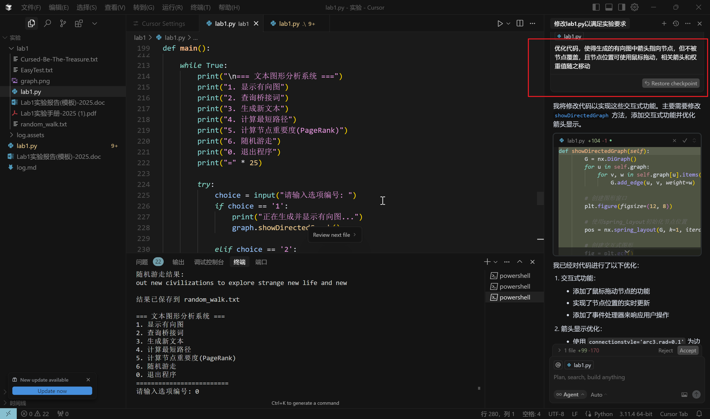

开始实现：


#### 优化过程


节点优化：

优化代码，使得生成的有向图中箭头指向节点，要求箭头两端均不在节点圆形范围内，且节点位置可使用鼠标拖动，相关箭头和权重值随之移动



  

要求在显示有向图图形化界面的同时通过自定义的格式在CLI（命令行界面）上进行展示生成的有向图，要求格式清晰，易于理解。

如：A→B    A→C
B→D   


计算节点重要度规则发生变化，添加一条：其中出度为0的节点需要将PR值均分给其他节点，例如：d 取0.85时new的PR值为0.24 。


要求将整个命令行操作界面变成图形化操作界面，一个按钮代表一个功能，与命令行界面对应功能不变


优化图形化操作界面布局和有向图图形展示界面布局

将按钮放在右侧（图形化操作界面），大小自适应界面

可使用鼠标滚轮放大或缩小有向图


#### Git

以下是完成实验2中Git实战部分的详细步骤和命令：

### 实验场景(1)：仓库创建与提交
#### R0：查看工作区、暂存区、git仓库的状态
```markdown
git status
```

#### R1：本地初始化一个git仓库
```markdown
git init
```

#### R2：将项目文件加入git管理并提交
```markdown
git add .
git commit -m "Initial commit"
```

#### R3：修改文件后查看状态和修改内容
```markdown
# 使用文本编辑器修改文件
git status
git diff
```

#### R4：重新提交修改
```markdown
git add .
git commit -m "Updated files"
```

#### R5：再次修改文件并提交
```markdown
# 使用文本编辑器再次修改文件
git add .
git commit -m "Another update"
```

#### R6：撤销最后一次提交
```markdown
git reset --soft HEAD^
```

#### R7：查看提交记录
```markdown
git log
```

### 实验场景(1)：推送到GitHub上
#### R8：创建远程仓库并关联本地仓库
```markdown
# 在GitHub上创建仓库后，复制仓库URL
git remote add origin <repository_url>
```

#### R9：推送本地仓库到GitHub
```markdown
git push -u origin master
```

### 实验场景(2)：分支管理
#### R1：查看和切换分支
```markdown
git branch
git checkout master
```

#### R2：创建新分支B1和B2
```markdown
git branch B1
git branch B2
```

#### R3：在B2基础上创建C4分支
```markdown
git checkout B2
git checkout -b C4
```

#### R4：在C4上修改文件并提交
```markdown
# 使用文本编辑器修改文件
git add .
git commit -m "Changes on C4"
```

#### R5：在B1上修改相同文件并提交
```markdown
git checkout B1
# 使用文本编辑器进行不同修改
git add .
git commit -m "Changes on B1"
```

#### R6：合并C4到B1并解决冲突
```markdown
git merge C4
# 如果有冲突，手动解决后
git add .
git commit -m "Merged C4 into B1"
```

#### R7：在B2上修改文件并提交
```markdown
git checkout B2
# 使用文本编辑器修改文件
git add .
git commit -m "Changes on B2"
```

#### R8：查看合并状态
```markdown
git branch --merged
git branch --no-merged
```

#### R9：删除已合并分支并合并未合并分支到新分支（学号命名）
```markdown
git branch -d C4
git checkout -b <your_student_id>
git merge B2
```

#### R10：推送新分支到GitHub
```markdown
git push origin <your_student_id>
```

#### R11：查看版本变迁树
```markdown
git log --graph --oneline --all
```

#### R12：在GitHub上查看仓库状态
```markdown
# 打开浏览器访问GitHub仓库页面
```

### 实验场景3：在IDE中使用Git管理程序
1. 在IDE（如IntelliJ IDEA、VS Code等）中，右键点击项目根目录，选择“Git”->“Add”将项目纳入Git管理。
2. 对项目文件进行修改后，在IDE的Git面板中提交更改。
3. 在IDE中选择“Push”将更改推送到GitHub仓库。

确保在实验过程中严格按照上述命令操作，以完成Git实战部分的所有要求。

